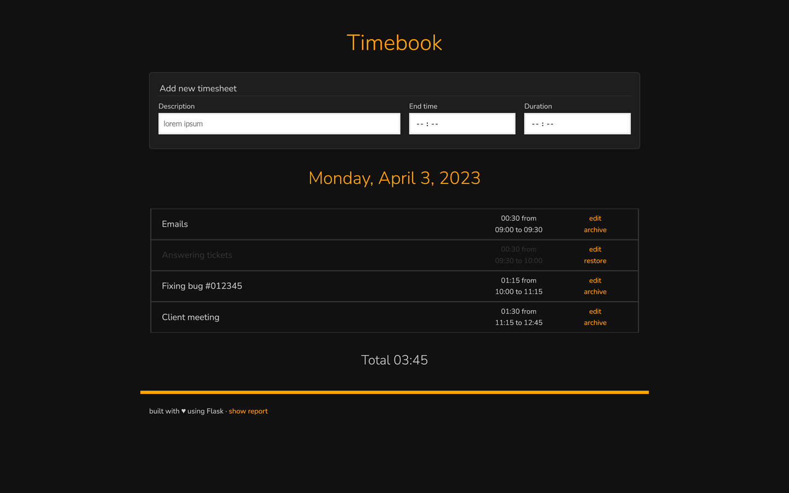

# timebook
Simple Flask application for tracking how you spend your time,
slightly inspired by Traggo - a tag-based time tracking tool.

## Virtual environment

    python3 -m venv venv
    source venv/bin/activate
    pip3 install -r requirements.txt

## Run the application

    flask run --host=0.0.0.0 --debug
