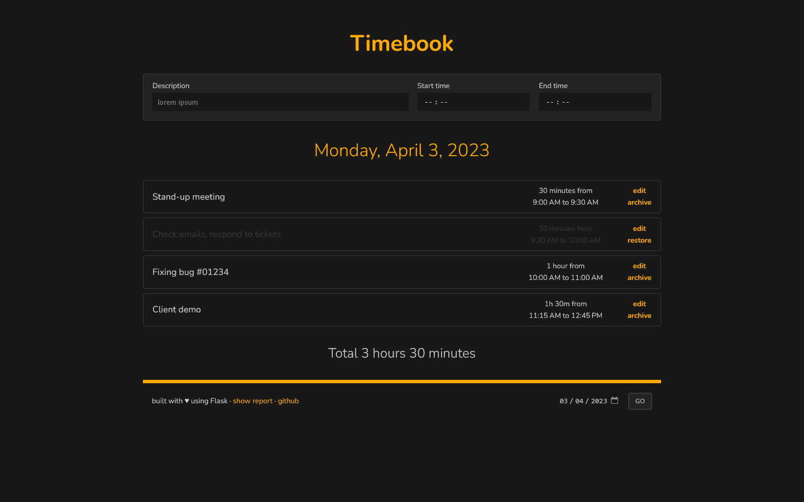

# Timebook
Simple web application for tracking how you spend your time,
slightly inspired by Traggo (a great open source tag-based time-tracking tool)
but without tags.

## Features
- Time-tracking based on free text description, start time and end time.
- List timespans by date, or show all.
- Generic "archived" status, to mark already reported/invoiced/whatever records.
- Light and dark themes.

## Virtual environment

    python3 -m venv .venv
    source .venv/bin/activate
    pip3 install -r requirements.txt

## Run the application

    flask run --host=0.0.0.0 --debug

## Command-line interface

    flask cli --help
    flask cli time-delete --help
    flask cli time-prune --help

## Credits
CSS style based on [ajusa/lit](https://github.com/ajusa/lit),
a ridiculously small responsive css framework.
